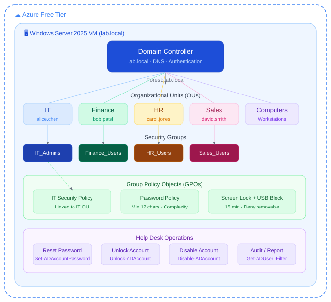
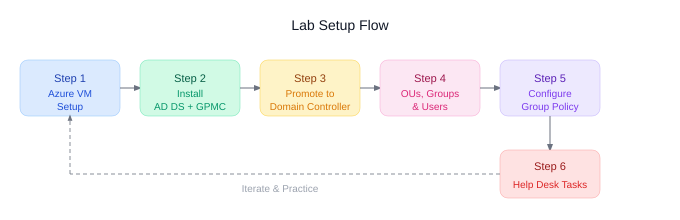

# 🧠 Active Directory Lab 1

**Windows Server 2025 · Azure Free Account · Identity & Access Management**

https://www.loom.com/share/5b70e07b87eb4f42b7b82620e2dad02a

---

## 📋 Lab Details

| Field | Value |
|---|---|
| **Certification Alignment** | CompTIA Network+ · Security+ · Azure Administrator |
| **Free Tools** | Windows Server 2025 Evaluation (180 days) · Azure Free Account |
| **Time to Complete** | 3–5 hours across multiple sessions |
| **Estimated Cost** | $0 — fully covered by free tiers and evaluation licences |
| **Career Relevance** | IT Support · Sysadmin · Cloud Engineer · Security Analyst |

---

## 💼 The Business Problem This Lab Solves

Every organisation that runs Windows infrastructure relies on Active Directory to answer one fundamental question:

> **Who is allowed to do what?**

Active Directory is the identity backbone. It controls which users can log into which computers, which groups can access which file shares, and which policies apply to which parts of the organisation.

When a new employee joins, IT creates their account in Active Directory and adds them to the right groups. Their access to email, shared drives, printers, and applications is granted automatically based on group membership. When they leave, IT disables one account and every door closes simultaneously.

This is not legacy technology. Hybrid environments use Active Directory on-premises and sync identities to Microsoft Entra ID (formerly Azure AD) in the cloud. Understanding how to build and manage an Active Directory environment is foundational knowledge that applies directly to cloud roles.

| Role | How This Lab Applies |
|---|---|
| **IT Support / Help Desk** | Password resets, account unlocks, group membership changes — the top three ticket types in any enterprise |
| **Sysadmin** | Designing OU structure, deploying GPOs, managing domain-joined machines at scale |
| **Cloud Engineer** | Entra ID (cloud AD) uses the same concepts: users, groups, roles, conditional access. On-prem AD knowledge transfers directly |
| **Security Analyst** | AD is the most targeted system in ransomware attacks. Understanding how it works is the foundation of defending it |

---

## 🎯 What You Will Learn

| Skill | Real-World Application |
|---|---|
| Promote a Windows Server to Domain Controller | The first step in every enterprise Windows environment. You own the domain from this moment forward |
| Create Organisational Units (OUs) | OUs are the folders of Active Directory. They let you apply different policies to different departments |
| Create users, groups, and group memberships | Every access decision in an enterprise is group-based. Learn to do this correctly once and it scales to thousands of users |
| Configure Group Policy Objects (GPOs) | GPOs enforce settings across every machine in the domain. Password policies, screen lock timers, software restrictions — all controlled centrally |
| Join a machine to the domain | Connecting a workstation so it becomes a managed, policy-enforced resource |
| Configure role-based access with security groups | The principle of least privilege applied practically: users only get what their job requires |
| Reset passwords and manage account lifecycle | The most frequent real-world task for IT support. You will do it correctly from day one |

---

## 🏗️ Lab Architecture





---

## 🚀 Step 1 — Get the Free Resources

### Option A — Run in Azure (Recommended)

Using Azure means no local hardware requirements. The VM runs in Microsoft's data centre, you connect via RDP from your desktop client, and you pay nothing within the free tier.

1. Go to [azure.microsoft.com/free](https://azure.microsoft.com/free) and create a free account
2. Sign in to [portal.azure.com](https://portal.azure.com)
3. Search for **Virtual machines** and click **Create**
4. Fill in the configuration below, then click **Review + Create**

| Setting | Value | Why |
|---|---|---|
| Region | East US | Cheapest region, most available VM sizes under free tier |
| Image | Windows Server 2025 Datacenter — Gen2 | Latest server OS, includes free 180-day evaluation licence |
| Size | Standard_D2alds (2 vCPU, 4GB RAM) | Smallest size that runs AD comfortably. Covered by free tier credits |
| Authentication | Password | Set a strong password — you will use this to RDP in |
| Public inbound ports | Allow RDP (3389) | Required to connect from your local machine |
| OS disk | Standard SSD | Good performance, included in free tier storage |

> ⚠️ Stop the VM when you are not using it. A D2alds VM costs roughly $0.20/hour. Stopping it (not deleting) pauses billing on compute. Your $200 free credit lasts much longer if you stop the VM at the end of every session.

### Fix: Enable Copy and Paste Between Your Local Machine and the VM

By default RDP does not share your clipboard. Fix this before you connect:

1. Open the **Remote Desktop** application on your local machine
2. Enter the VM's public IP address
3. Click **Show Options** (bottom left of the RDP window)
4. Click the **Local Resources** tab
5. Make sure **Clipboard** is checked under Local devices and resources
6. Click **Connect** — copy and paste now works in both directions

✅ Tip: Download the RDP file from the Azure portal (**Connect → Download RDP File**) and open it with the native Remote Desktop app instead of the browser-based console. This is the recommended approach for all lab work.

---

### Option B — Run Locally with VirtualBox

VirtualBox is free virtualisation software from Oracle. You can run Windows Server 2025 on your own machine without any cloud account.

1. Download VirtualBox from [virtualbox.org](https://www.virtualbox.org) — free, no account required
2. Download the Windows Server 2025 Evaluation ISO from [Microsoft Evaluation Center](https://www.microsoft.com/en-us/evalcenter/)
3. Create a new VM in VirtualBox: 4GB RAM minimum, 60GB disk, Windows Server 2019/2022 as the type
4. Mount the ISO and boot the VM — follow the installation wizard
5. Select **Windows Server 2025 Datacenter with Desktop Experience** during setup

> ⚠️ Minimum local hardware: 8GB RAM on your host machine (4GB for the VM, 4GB for your OS), 60GB free disk space, a quad-core CPU with virtualisation enabled in BIOS. If your machine has less than 8GB RAM, use the Azure option instead.

---

## 🖥️ Step 2 — Install Active Directory Domain Services

RDP into your Windows Server VM. Open **Server Manager** — it opens automatically on login. All configuration from here is done inside the VM.

### What is a Domain Controller?

A Domain Controller (DC) is a server that runs Active Directory. It is the brain of the entire identity system. When a user logs in anywhere on the domain, their credentials are checked against the Domain Controller. There is usually more than one in an enterprise for redundancy, but we are building one here. Everything that joins your network will trust this server to make authentication decisions.

### Using Server Manager

1. Click **Manage** → **Add Roles and Features**
2. Click **Next** through the wizard until you reach **Server Roles**
3. Check **Active Directory Domain Services**
4. Click **Add Features** when prompted to include the management tools
5. Click **Next** through the remaining pages and click **Install**
6. Wait 2–3 minutes for installation to complete, then click **Close** — do not restart yet

### PowerShell:

```powershell
Install-WindowsFeature -Name AD-Domain-Services -IncludeManagementTools
```

### Also Install Group Policy Management Console (GPMC)

Step 5 requires the Group Policy Management Console — a separate tool from Active Directory Users and Computers. Install it now so it is ready when you need it.

```powershell
Install-WindowsFeature -Name GPMC
```

✅ Tip: Once installed, **Group Policy Management** will appear in the Tools menu in Server Manager. It is a completely separate window from Active Directory Users and Computers — do not look for GPOs inside ADUC.

---

## 🌐 Step 3 — Promote the Server to a Domain Controller

Installing the AD DS role does not create a domain. Promotion is the step that creates your forest, your domain, and makes this server the authoritative DNS and identity server for everything that joins it.

### What is a Forest and Domain?

A **Forest** is the top-level container of your entire Active Directory structure — think of it as the organisation itself. A **Domain** is a boundary inside the forest with a name (`lab.local`). Most small-to-medium organisations have one domain inside one forest. Large enterprises may have multiple domains.

### Using Server Manager

1. Click the **yellow warning flag** at the top right of Server Manager
2. Click **Promote this server to a domain controller**
3. Select **Add a new forest**
4. Set Root domain name to: `lab.local`
5. Click **Next** — set a DSRM password (write it down — needed for disaster recovery only)
6. Click through DNS Options and NetBIOS pages — accept the defaults
7. Click **Install** — the server will automatically restart when complete

### PowerShell:

```powershell
Import-Module ADDSDeployment
Install-ADDSForest `
  -DomainName "lab.local" `
  -DomainNetBiosName "LAB" `
  -InstallDns:$true `
  -SafeModeAdministratorPassword (ConvertTo-SecureString "YourDSRMPassword!" -AsPlainText -Force) `
  -Force:$true
```

✅ Result: You created a new Active Directory forest called `lab.local`. This server is now the root domain controller — it runs DNS for the domain and is the authoritative source for all identity decisions. Every machine that joins `lab.local` will trust this server to authenticate users.

---

## 🗂️ Step 4 — Build the Organisational Structure

Open **Active Directory Users and Computers (ADUC)** from the Tools menu in Server Manager. This is the primary GUI for managing the directory.

### What is an Organisational Unit (OU)?

An OU is a folder inside Active Directory. You use OUs to organise users, computers, and groups by department, location, or function. The real power of an OU is that you can link a Group Policy to it — every user or computer inside that OU automatically gets the policy applied. IT gets one set of policies. Finance gets another. HR gets another. All from one central place, without touching each machine individually.

### Create Organisational Units

Right-click your domain (`lab.local`) in ADUC → **New** → **Organizational Unit**. Create one OU per department and one for computers.

```powershell
New-ADOrganizationalUnit -Name "IT"        -Path "DC=lab,DC=local"
New-ADOrganizationalUnit -Name "Finance"   -Path "DC=lab,DC=local"
New-ADOrganizationalUnit -Name "HR"        -Path "DC=lab,DC=local"
New-ADOrganizationalUnit -Name "Sales"     -Path "DC=lab,DC=local"
New-ADOrganizationalUnit -Name "Computers" -Path "DC=lab,DC=local"
```

### What is a Security Group?

A Security Group is a container that holds user accounts. Instead of granting access to a resource to individual users one by one, you grant access to a group and add users to it. This is **role-based access control (RBAC)**. When someone joins Finance, add them to the group — they instantly inherit all Finance access. When they leave, remove them and all access is revoked simultaneously.

### Create Security Groups

Right-click each OU → **New** → **Group**. Set Group scope to **Global** and Group type to **Security**.

```powershell
New-ADGroup -Name "IT_Admins"     -GroupScope Global -GroupCategory Security -Path "OU=IT,DC=lab,DC=local"
New-ADGroup -Name "Finance_Users" -GroupScope Global -GroupCategory Security -Path "OU=Finance,DC=lab,DC=local"
New-ADGroup -Name "HR_Users"      -GroupScope Global -GroupCategory Security -Path "OU=HR,DC=lab,DC=local"
New-ADGroup -Name "Sales_Users"   -GroupScope Global -GroupCategory Security -Path "OU=Sales,DC=lab,DC=local"
```

### What is a User Account?

A User Account represents a person in Active Directory. It contains the username, password hash, group memberships, and attributes like email and department. The user account is the single identity that controls everything — email, file shares, printers, applications — all based on which groups the account belongs to.

### Create User Accounts

> ⚠️ Run this entire block at once — not line by line. The `$password` variable must be defined before the `New-ADUser` commands or PowerShell will prompt you for a Name and the script will fail. Select all, then press **F8** in PowerShell ISE, or paste the whole block into a regular PowerShell window and press **Enter**.

```powershell
# IMPORTANT: Run this entire block together — not line by line

# Step 1 — define the password variable first
$password = ConvertTo-SecureString "Welcome@2026!" -AsPlainText -Force

# Step 2 — create all 4 users
New-ADUser -Name "alice.chen" -GivenName "Alice" -Surname "Chen" `
  -SamAccountName "alice.chen" -UserPrincipalName "alice.chen@lab.local" `
  -Path "OU=IT,DC=lab,DC=local" -AccountPassword $password -Enabled $true

New-ADUser -Name "bob.patel" -GivenName "Bob" -Surname "Patel" `
  -SamAccountName "bob.patel" -UserPrincipalName "bob.patel@lab.local" `
  -Path "OU=Finance,DC=lab,DC=local" -AccountPassword $password -Enabled $true

New-ADUser -Name "carol.jones" -GivenName "Carol" -Surname "Jones" `
  -SamAccountName "carol.jones" -UserPrincipalName "carol.jones@lab.local" `
  -Path "OU=HR,DC=lab,DC=local" -AccountPassword $password -Enabled $true

New-ADUser -Name "david.smith" -GivenName "David" -Surname "Smith" `
  -SamAccountName "david.smith" -UserPrincipalName "david.smith@lab.local" `
  -Path "OU=Sales,DC=lab,DC=local" -AccountPassword $password -Enabled $true

# Step 3 — add each user to their department group
Add-ADGroupMember -Identity "IT_Admins"     -Members "alice.chen"
Add-ADGroupMember -Identity "Finance_Users" -Members "bob.patel"
Add-ADGroupMember -Identity "HR_Users"      -Members "carol.jones"
Add-ADGroupMember -Identity "Sales_Users"   -Members "david.smith"
```

---

## 🔐 Step 5 — Configure Group Policy

Open **Group Policy Management** from the Tools menu in Server Manager.

### What is a Group Policy Object (GPO)?

A GPO is a collection of settings applied automatically to every user or computer inside an OU. You create one GPO, link it to an OU, and every machine and user in that OU gets those rules applied the next time they log in or run `gpupdate`. Password complexity, screen lock timers, USB restrictions, software installation controls — all enforced from a single GPO across thousands of machines without touching each one.

### Create and Configure the GPO

1. Expand **Forest: lab.local** → **Domains** → **lab.local** in Group Policy Management
2. Right-click the **IT OU** → **Create a GPO in this domain and link it here**
3. Name it: `IT Security Policy`
4. Right-click the new GPO → **Edit**
5. Configure the following settings:

| Policy Path | Setting | Value | Why |
|---|---|---|---|
| Computer Config → Windows Settings → Security → Account Policies → Password Policy | Minimum password length | 12 | Enforces strong passwords across all IT accounts |
| Computer Config → Windows Settings → Security → Account Policies → Password Policy | Password must meet complexity requirements | Enabled | Requires upper, lower, number, and symbol |
| Computer Config → Windows Settings → Security → Local Policies → Security Options | Interactive logon: Machine inactivity limit | 900 seconds | Auto-locks screen after 15 minutes |
| Computer Config → Administrative Templates → System → Removable Storage Access | All removable storage classes: Deny all access | Enabled | Prevents data exfiltration via USB drives |

✅ Tip: To test your GPO, join a second VM to `lab.local`, move its computer account into the IT OU, run `gpupdate /force`, log in as `alice.chen`, and verify the screen lock policy takes effect.

---

## 🛠️ Step 6 — Common Help Desk Tasks

These are the top tasks every IT support role expects you to perform on day one. Practice each one on your test accounts.

### Reset a Password

The most common help desk ticket. Always force a password change on next login so the user sets their own password immediately.

```powershell
Set-ADAccountPassword -Identity "bob.patel" -Reset `
  -NewPassword (ConvertTo-SecureString "NewPass@2026!" -AsPlainText -Force)
Set-ADUser -Identity "bob.patel" -ChangePasswordAtLogon $true
```

### Unlock a Locked Account

Accounts lock automatically after too many failed login attempts. This is one of the most frequent calls to any help desk.

```powershell
Unlock-ADAccount -Identity "carol.jones"
```

### Disable an Account (Employee Offboarding)

When someone leaves the organisation, disable their account rather than deleting it. Disabling preserves the account history and group memberships for audit purposes. Deletion is permanent.

```powershell
# Disable an account
Disable-ADAccount -Identity "david.smith"

# Find all currently disabled accounts
Search-ADAccount -AccountDisabled | Select-Object Name, SamAccountName
```

### Audit and Reporting

Security and compliance teams regularly need reports on inactive accounts, group memberships, and login activity.

```powershell
# Find accounts that have not logged in for 90 days
$cutoff = (Get-Date).AddDays(-90)
Get-ADUser -Filter {LastLogonDate -lt $cutoff -and Enabled -eq $true} `
  -Properties LastLogonDate | Select-Object Name, LastLogonDate

# Check group membership for a specific user
Get-ADPrincipalGroupMembership -Identity "alice.chen" | Select-Object Name
```

---

## ✅ Verification — Confirm the Lab is Working

| Check | Command | Expected Result |
|---|---|---|
| Domain controller is running | `Get-ADDomainController` | Returns DC info including forest `lab.local` |
| OUs exist | `Get-ADOrganizationalUnit -Filter *` | Lists all 5 OUs you created |
| Users exist and are enabled | `Get-ADUser -Filter {Enabled -eq $true}` | Lists your 4 test accounts |
| Group memberships correct | `Get-ADGroupMember -Identity IT_Admins` | Returns `alice.chen` |
| GPO is linked | `Get-GPInheritance -Target 'OU=IT,DC=lab,DC=local'` | Shows IT Security Policy as linked |

---

## 🐞 Troubleshooting

| Problem | Fix |
|---|---|
| PowerShell prompts for `Name:` when creating users | Run the entire script block at once — the `$password` line must come first. Copy the full block from Step 4 and run it all together |
| Cannot copy and paste into the VM | Open the RDP client → Show Options → Local Resources tab → check Clipboard. Or download the RDP file from the Azure portal and open it with the native Remote Desktop app |
| Promotion fails: DNS conflict | Set the NIC's preferred DNS to `127.0.0.1` before promoting, or use the static IP of the VM |
| Cannot RDP after domain join | Log in as `LAB\Administrator` (domain admin), not just `Administrator` |
| GPO not applying | Run `gpupdate /force` on the target machine, then `gpresult /r` to see applied policies |
| User cannot log in after creation | Confirm the account is Enabled and `ChangePasswordAtLogon` is set correctly |
| AD Users and Computers not showing | Run `dsa.msc` from the Run dialog, or run `Add-WindowsFeature RSAT-ADDS` |

---

## 📝 Notes


